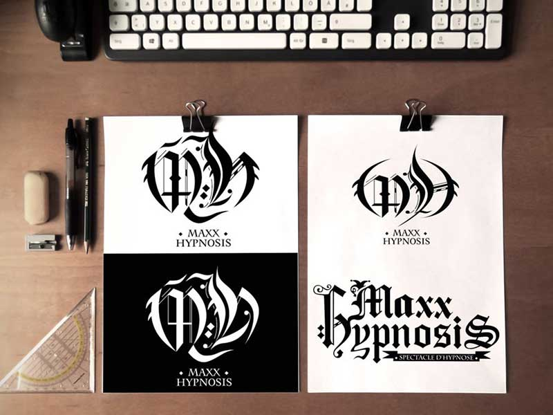

# `Portfolio`
---
---
## Mise en place
-   **Créez** un *dossier* sur le *serveur local*.
-   **Téléchargez** *Bootstrap 3* et déplacer le contenu de l'archive
dans le *dossier du projet*
-   **Créez** un fichier `index.html`
-   **Rendez-vous** sur
[*getBootstrap.com*](http://getbootstrap.com/docs/3.3/getting-started/#template)
-   Sur la page *`Getting Started`* **identifiez** la section *`Basic
Template`* dans le menu de droite
-   **Copiez/Collez** le code du *`Basic Template`* de démarrage dans
le fichier `index.html`
-   **Remarquez**que les déclarations des fichiers `CSS` &
`JavaScript` sont déjà écrites ainsi que celle de `jQuery`
-   **Remplacer** le `<titre>` et **ajouter** vos `<meta>`

```html
  <head>
    <meta charset="utf-8">
    <meta http-equiv="X-UA-Compatible" content="IE=edge">
    <meta name="viewport" content="width=device-width,
     initial-scale=1">
   <title>Bootstrap 101 Template</title>
```

---

## Menu de Navigation
-   **Récupérez** la `NavBar` dans
[*Components*](http://getbootstrap.com/docs/3.3/components/#navbar-fixed-top), **Cliquez** sur *`fixed to top`* puis *copiez/collez* le code en remplaçant le `<h1>` *'Hello World'*

```html
  <nav class="navbar navbar-default navbar-fixed-bottom">
    <div class="container">
      ...
    </div>
  </nav>
```

-   Dans le menu du site, **cliquez** sur `Navbar > Default Navbar` &
**copiez/collez** le code de la `<div class='navbar-header'>` dans le
container ci-dessus afin d'obtenir un menu responsive.
-   **Renommez** l'attribut `data-target` en `#nav` pour simplifier
l'iddentifiant trop long.

```html
  <div class="container">
    <div class="navbar-header">
      <button type="button" class="navbar-toggle collapsed"
      data-toggle="collapse" data-target="#nav"
      aria-expanded="false">
        <span class="sr-only">Toggle navigation</span>
        <span class="icon-bar"></span>
        <span class="icon-bar"></span>
        <span class="icon-bar"></span>
      </button>
      <a class="navbar-brand" href="#">Brand</a>
    </div>
  </div>
  ```

-   **Ajoutez** à la suite de la `<div class="navbar-header">` (en
veillant à rester dans la `<div class="container">`) une `<div
id="nav">`  dans laquelle vous **créez** une *liste à puce* qui servira
de `menu de navigation`.

```html
  </div><!--end toggle navigation-->
  <div class="collapse navbar-collapse navbar-right" id="nav">
    <ul class="nav navbar-nav">
        <li><a href="#">Présentation</a></li>
          <li><a href="#">Services</a></li>
          <li class="active"><a href="#">Portfolio</a></li>
          <li><a href="#">Blog</a></li>
          <li><a href="#">Contact</a></li>
      </ul>
  </div>
</div><!--end container-->
</nav><!--end nav-->
```
---
## Création du header

-   **Créez** une `<div class='col-lg-12 soustitre'>`
-   **Ajourez** un container pour le sous-titre en `<h1>`

```html
</nav><!--end nav-->
<div class="col-lg-12 soustitre row">
  <div class="container">
    <h1 class="page-header">Mes Projets</h1>
  </div>
</div><!-- end soustitre -->
```
---
## Affichage des projets
-   **Récupérez** le dossier `img` sur le serveur
-   **Définissez** un nouveau `container` pour votre grille d'image,
**insérez** une `row` et **créez** les colonnes avec `col-md-4` et
ajoutez une class `folio` pour pouvoir la styliser ensuite via le `CSS`
-   **Placez** dans la `<div class="col-md-4">` un `lien`contenant une
image responsive grace à la classe ìmg-responsive`
-   Réalisez l'opération autant de fois qu'il y a d'image (attention à
la numérotation du `data-target="Modal1"` cela nous servira plus tard)

```html
</div>
<!--end sous-titre-->

<!--content-->
<div class="container">
  <div class="row">
      <div class="col-md-4 folio">
          <a href="#" data-toggle="modal" data-target="#Modal1">
            
          </a>
        </div> <!--end col-md-4-->
```

---

## Footer
-   **Sortez** du container principal, et **ajoutez** la balise
`<footer>`
-   **Insérez** une `<div>` avec les classes `row` `soustitre` &
`text-center`

```html
  </div><!--end container-->
  <footer class="container">
        <div class="soustitre text-center row">
            <p class="col-lg-12">Copyright &copy; mon site 2018</p>
          </div><!--end col-lg-12-->
  </footer> <!--end footer-->
```

---

## Un peu de Javascript, pas de panique
-   Nous allons mettre en place des `modal PopUp` animées,
**rendez-vous** sur
[*Javascript*](https://getbootstrap.com/docs/3.3/javascript/#modals-sizes) et **repérez** la section `Modal > Size` et copiez le bout de code correspondant à `Large Modal` dans `Optional Size` (sans le bouton) et **collez** le bout de code sous votre première image
-   Toujours dans la partie `Modal` sur le site, **localisez** le
sous-titre "Live Demo" et récupérez le code à l'intérieur de la `<div
class="modal-content">` et **retirez** le `modal-footer`
-   **Ajoutez** une image responsive dans le `modal-body`ainsi qu'un
paragraphe de description

```html
  </div><!--end col-md-4-->

  <div class="modal fade" id="Modal1" tabindex="-1"
  role="dialog" aria-labelledby="myLargeModalLabel">
      <div class="modal-dialog modal-lg" role="document">
          <div class="modal-content">

              <div class="modal-header">
                  <button type="button" class="close"
data-dismiss="modal"                     aria-label="Close">
                    <span aria-hidden="true">&times;</span>
                  </button>
                  <h4 class="modal-title text-center text-uppercase"
                  id="myModalLabel">Titre de mon projet</h4>
              </div>
              <div class="modal-body">
                  
                  <div class="boite text-center">
                      <p>
                        ...
                      </p>
                  </div>
              </div>
          </div>
      </div>
  </div> <!--end modal-->
```

-   Et Voilà, la structure est terminée. Il ne vous reste plus qu'à styliser via le `CSS` et laissez libre cours à votre créativité.
